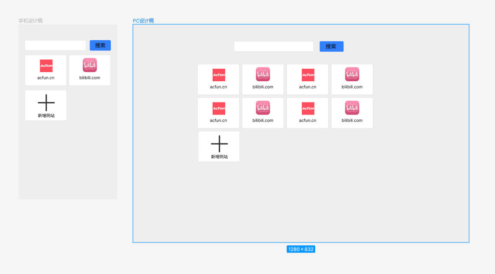

# 书香导航
# 预览链接： [Bookish-navigation](https://xin-hai.github.io/Bookish-navigation/dist/index.html)
# yarn init -y 命令
初始化package.json
# yarn  build 命令
```angular2html
 rm -rf dist && parcel build src/index.html --no-minify --public-url ./
```
# 小提示
* 按键盘上的字母可快速进入你想进入的相关网站
* 新增网址后会存储在Local Storage中，不用担心丢失
# 支持移动端和PC端
## 移动端和PC端设计稿
* 
